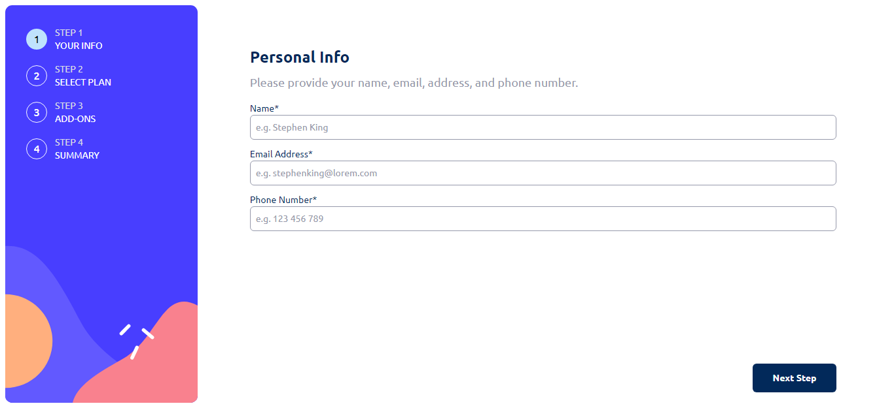
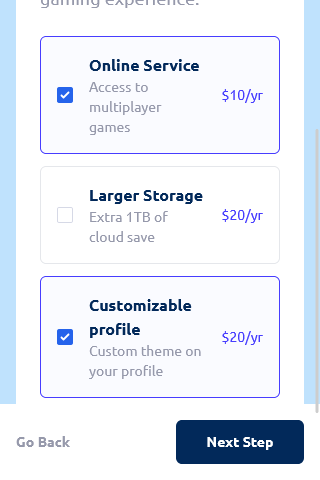

# Frontend Mentor - Multi-step form solution

This is a solution to the [Multi-step form challenge on Frontend Mentor](https://www.frontendmentor.io/challenges/multistep-form-YVAnSdqQBJ). Frontend Mentor challenges help you improve your coding skills by building realistic projects.

## Table of contents

- [Overview](#overview)
  - [The challenge](#the-challenge)
  - [Screenshot](#screenshot)
  - [Links](#links)
- [My process](#my-process)
  - [Built with](#built-with)
- [Author](#author)

## Overview

### The challenge

Users should be able to:

- Complete each step of the sequence
- Go back to a previous step to update their selections
- See a summary of their selections on the final step and confirm their order
- View the optimal layout for the interface depending on their device's screen size
- See hover and focus states for all interactive elements on the page
- Receive form validation messages if:
  - A field has been missed
  - The email address is not formatted correctly // TODO
  - A step is submitted, but no selection has been made

### Screenshot

### Links

- Solution URL: [https://github.com/WeslleySORDev/multistepform-challenge](https://github.com/WeslleySORDev/multistepform-challenge)
- Live Site URL: [https://wsormultistepform.netlify.app/](https://wsormultistepform.netlify.app/)

## My process

### Built with

- Semantic HTML5 markup
- CSS custom properties
- Flexbox
- CSS Grid
- Mobile-first workflow
- [React](https://reactjs.org/) - JS library
- [Vitejs](https://vitejs.dev/) - Javascript Compilation Tool
- [Tailwindcss](https://tailwindcss.com/) - For styles

## Author

- Website - [WeslleySOR](https://wsorportifolio.netlify.app/)
- Frontend Mentor - [@WeslleySORDev](https://www.frontendmentor.io/profile/WeslleySORDev)
- Linkedin - [@weslleysordev](https://www.linkedin.com/in/weslleysordev/)

# Mudanças

- [ ] Componentizar todas as partes do form para melhor entendimento e facil futura manutenção.
- [ ] Utilizar react hook form para tornar os formulários mais eficientes e reduz o número de novas renderizações e melhorar
      a questão de criação e validação dos formulários
